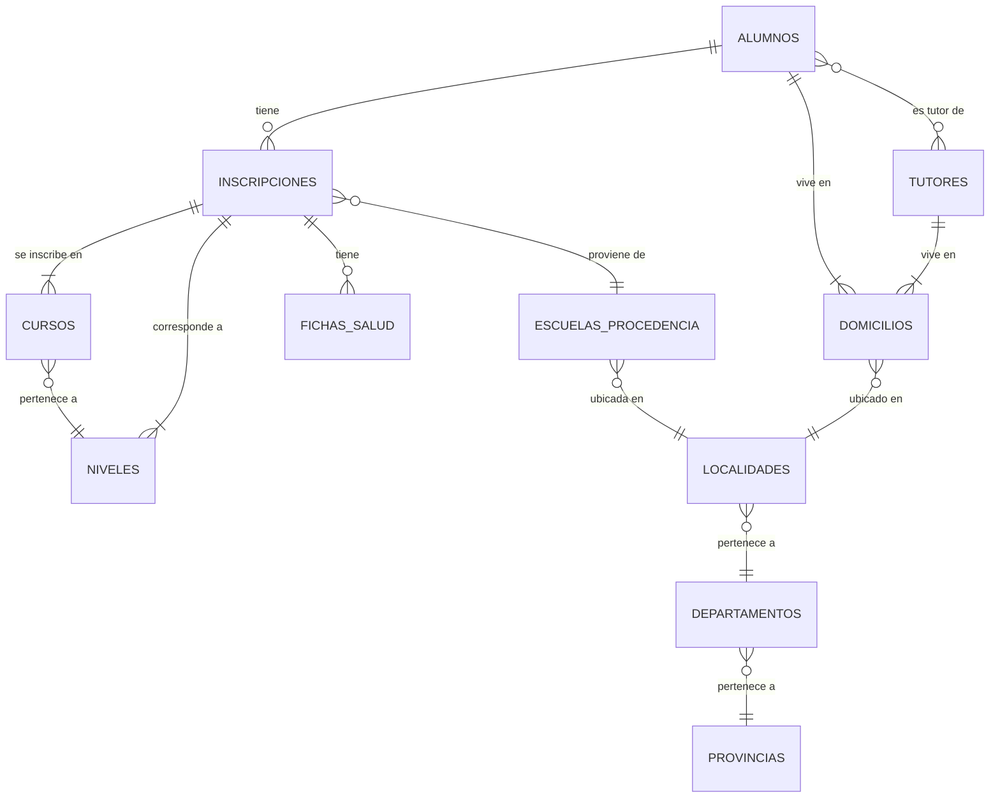

# Estructura de la Base de Datos del Sistema de Inscripciones

Este documento detalla la arquitectura de la base de datos, incluyendo las tablas, sus atributos y las relaciones entre ellas.

## Diagrama de Entidad-Relación (Conceptual)

## Descripción de Tablas y Entidades

### `alumnos`
Representa a los estudiantes. Es una entidad central en el sistema.

- `id`: (PK) Identificador único.
- `apellido`: Apellido del alumno.
- `nombre`: Nombre del alumno.
- `dni`: (Unique) Documento Nacional de Identidad.
- `fecha_nacimiento`: Fecha de nacimiento.
- `nacionalidad`: Nacionalidad.
- `genero`: Género del alumno.
- `foto`: Path a la foto del perfil.
- `domicilio_id`: (FK) Relación con la tabla `domicilios`.
- `padre_madre`, `tutor`: Campos de texto (posiblemente legados o para info rápida).

### `tutores`
Representa a los padres, madres o tutores legales del alumno.

- `id`: (PK) Identificador único.
- `apellido`: Apellido del tutor.
- `nombre`: Nombre del tutor.
- `dni`: (Unique) Documento Nacional de Identidad.
- `estudios`: Nivel de estudios del tutor.
- `ocupacion`: Ocupación laboral.
- `telefono`: Número de contacto.
- `domicilio_id`: (FK) Relación con la tabla `domicilios`.

### `alumnos_tutores`
Tabla pivote para la relación Muchos a Muchos entre `alumnos` y `tutores`.

- `alumno_id`: (FK) ID del alumno.
- `tutor_id`: (FK) ID del tutor.

### `domicilios`
Almacena información de direcciones.

- `id`: (PK) Identificador único.
- `calle`, `numero`, `piso`, `depto`, etc.: Campos de la dirección.
- `provincia_id`: (FK) Relación con `provincias`.
- `departamento_id`: (FK) Relación con `departamentos`.
- `localidad_id`: (FK) Relación con `localidades`.

### `inscripciones`
Modela la inscripción de un alumno a un curso para un ciclo lectivo específico. Es la entidad transaccional principal.

- `id`: (PK) Identificador único.
- `fecha`: Fecha de la inscripción.
- `ciclo_lectivo`: Año del ciclo lectivo.
- `repite`: Booleano si el alumno repite el año.
- `materias_pendientes`: Texto para listar materias adeudadas.
- `promedio`, `puntaje`: Datos numéricos para evaluación.
- `alumno_id`: (FK) Alumno que se inscribe.
- `curso_id`: (FK) Curso al que se inscribe.
- `nivel_id`: (FK) Nivel educativo de la inscripción.
- `escuela_procedencia`: Nombre de la escuela anterior.

### `fichas_salud`
Información médica relevante asociada a una inscripción.

- `id`: (PK) Identificador único.
- `enfermedad_cronica`, `alergia`, `discapacidad`, `medicamentos`: Información de salud.
- `vacunacion_completa`: Booleano.
- `observaciones`: Campo de texto libre.
- `inscripcion_id`: (FK) Relación con la inscripción correspondiente.

### `cursos`, `niveles`
Entidades académicas.

- **`niveles`**: Define los niveles educativos (Ej: Básico, Superior).
  - `id`, `codigo`, `ciclo`.
- **`cursos`**: Define los cursos específicos de un nivel.
  - `id`, `codigo`, `nivel`, `turno`, `division`.

### `escuelas_procedencia`
Catálogo de escuelas de donde pueden provenir los alumnos.

- `id`: (PK) Identificador único.
- `cue`: (Unique) CUE de la escuela.
- `nombre`: Nombre de la escuela.
- `localidad_id`: (FK) Ubicación de la escuela.

### `provincias`, `departamentos`, `localidades`
Catálogos para la información geográfica.

- **`provincias`**: `id`, `nombre`.
- **`departamentos`**: `id`, `nombre`.
- **`localidades`**: `id`, `nombre`.

### `users`, `password_reset_tokens`, `sessions`
Tablas estándar de Laravel para autenticación y manejo de sesiones de usuarios del sistema (personal administrativo).

## Resumen de Relaciones Clave

- **Alumno - Tutor**: Muchos a Muchos (`alumnos_tutores`). Un alumno puede tener varios tutores y un tutor puede ser responsable de varios alumnos.
- **Alumno - Domicilio**: Uno a Uno. Cada alumno tiene un domicilio registrado.
- **Tutor - Domicilio**: Uno a Uno. Cada tutor tiene su propio domicilio.
- **Inscripción - Alumno**: Muchos a Uno. Un alumno puede tener varias inscripciones a lo largo de los años, pero cada inscripción pertenece a un solo alumno.
- **Inscripción - Curso**: Muchos a Uno. Varios alumnos se inscriben a un mismo curso.
- **Inscripción - Ficha de Salud**: Uno a Uno. Cada inscripción tiene una única ficha de salud asociada.
- **Domicilio - Localidad/Departamento/Provincia**: Muchos a Uno.
